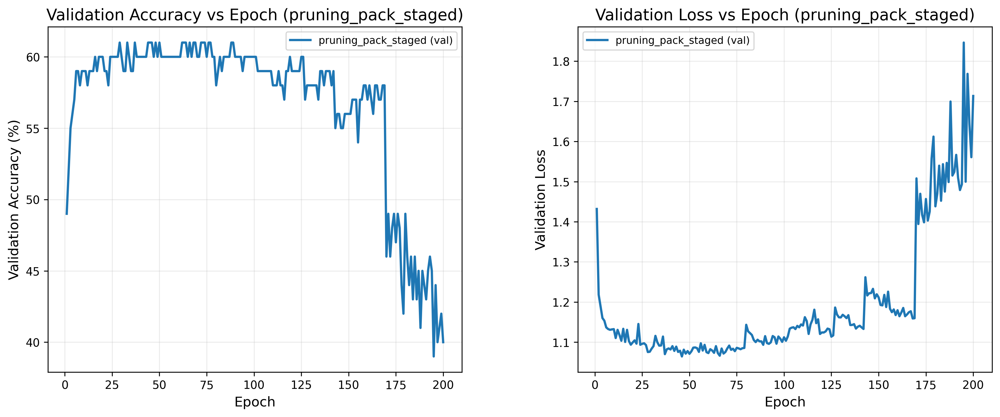
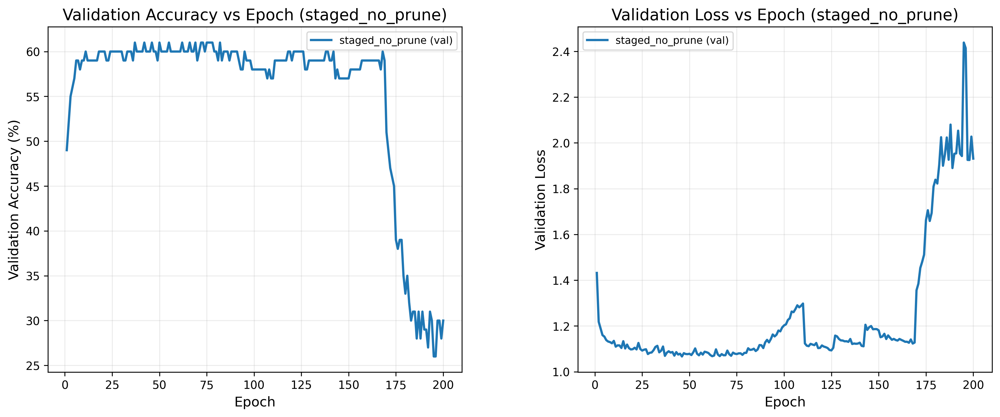
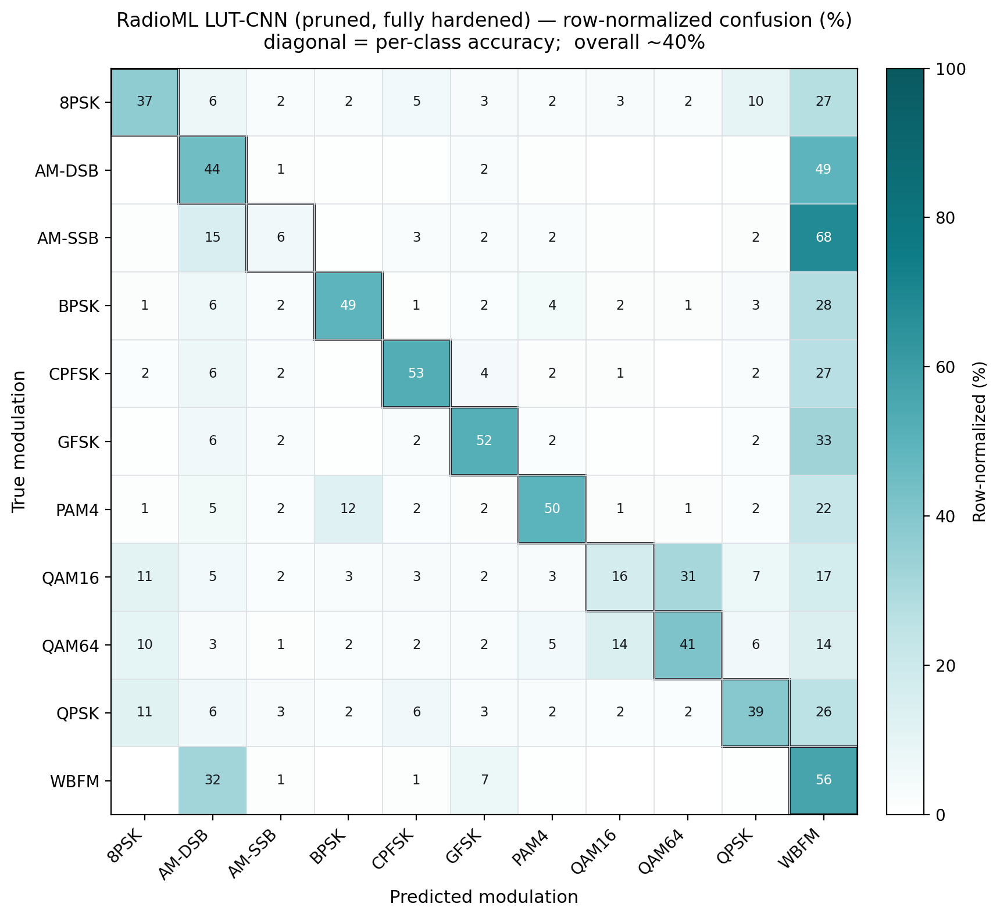

# RadioML-LUT: Porting the Hardware-Aware LUT Workflow to 1-D IQ Signals

This is where the two halves of the repository meet. [`LutNet/`](../LutNet) studied a LUT-based
pruning/packing workflow on CIFAR-10 images; [`RadioML/`](../RadioML) studied conventional CNN
failure modes on RadioML. **This folder ports the LUT hardware-aware workflow onto the RadioML
1-D IQ task** — the core contribution of the UROP 1100 final report
*"Investigating Ultra-Fast LUT-based Neural Networks for FPGAs"* (Advisor: Prof. Wei Zhang, HKUST).

> Scope note — like `LutNet/`, this folder emphasizes the adaptation, experiments, and results.
> It does not include the full original collaborative LUT framework. The figures and result files
> here are my own experiment outputs.

---

## 1. Why this is hard

On an FPGA the unit of compute is a lookup table, not a multiplier, so LUT operators expect
binary-compatible inputs. RadioML is a *stream* (`[B, 2, 128]` IQ) rather than an image patch, and
modulation classes are separated by subtle phase/amplitude/temporal structure. Two problems had to
be solved before the CIFAR workflow would run here at all.

## 2. What I implemented

| Piece | What it does |
|---|---|
| **Bitplane IQ preprocessing + `LUTQuant1d`** | Clamp/scale IQ to unsigned 8-bit, unpack into 8 bitplanes per channel (`[B,2,128] → [B,16,128]`), quantize each I/Q bitplane group independently. |
| **`LUTConv1d`** | Reworked the patch-extraction frontend for 1-D signal shape, keeping the LUT kernel and its sensitivity / mask / pruning interfaces intact. |
| **6-stage residual LUT backbone** | Widths 32 / 64 / 128; pooling → `ChannelPadAvgPool1d`, `BatchNorm2d → BatchNorm1d`, dense classifier head. |
| **Decoupled hardening** | Conv-LUT hardening separated from activation hardening — binary activations are forced **only after** every conv layer hardens. Enabling them early collapsed training. |

The `pruning_pack_staged` schedule is ordered by the hardware transition, not for convenience:
warmup → pairing → BIB regularization → **prune while soft (epoch 80)** → recovery → τ ramp →
progressive conv hardening → activation hard (~epoch 170) → final τ ramp (→ 8.0).

## 3. Key experiment — the ablation

Same hardening flow; pruning-side preparation (pairing + BIB + pruning + recovery) turned **on vs. off**.

| Run | Final test acc | Behaviour |
|---|---|---|
| **Pruning-first** (`pruning_pack_staged`) | **~40%** | No collapse at pruning; holds mid/high-40s deep into hardening |
| No-prune control (`staged_no_prune`) | ~29% | Craters once activations go binary |

Best validation accuracy was **61.09% at epoch 37** (soft regime). Both runs stay ~60% through
pruning and conv hardening; the divergence begins at activation hardening (~epoch 170).
**Structural preparation buys +11 points** through the binary transition.




Pruning removed real structure — layer-wise mask sparsity rises with depth (0.23 → 0.42), giving
**≈38% input-pin pruning and an estimated ~31% slice reduction** (analytical, Union-5 constraint;
see `results/pruning_packing_summary.csv`). These are estimates from the pruned topology, **not
FPGA-synthesis-verified.**

## 4. What breaks, and why

The fully hardened model reaches ~40% overall but fails on specific classes
(`results/class_accuracy.txt`, `results/confusion_matrix_normalized.csv`):



- **AM-SSB collapses to 5.8%** — 68% of it is read as WBFM.
- **WBFM absorbs the analog classes**; QAM16 ↔ QAM64 confuse (QAM16 → QAM64 = 31%).
- These are exactly the classes the conventional-CNN analysis in [`RadioML/`](../RadioML) flagged as
  needing fine amplitude/phase detail — evidence the bottleneck is **representational**, not just
  optimization. Hard binary activations destroy the gradations those classes depend on.

## 5. Limitations & next steps

- The late activation-hard / high-τ regime is the bottleneck; accuracy drops fastest at ~epoch 170
  and does not recover. Stabilizing it is the main open problem.
- Tested at a single sparsity / pack-ratio configuration; sweeps are future work.
- Packing metrics are analytical only — physical plan generation, netlist export, and FPGA
  synthesis remain to be done.

## Files

```
RadioML-LUT/
├── figures/
│   ├── epoch_compare_pruning_pack_staged.png   # pruning-first training/val curves
│   ├── epoch_compare_staged_no_prune.png       # no-prune control curves
│   └── confusion_lut_pruned.png                # row-normalized confusion, hardened LUT-CNN
└── results/
    ├── class_accuracy.txt                      # per-class accuracy (overall ~40%)
    ├── confusion_matrix_normalized.csv         # 11×11 row-normalized confusion
    └── pruning_packing_summary.csv             # layer-wise sparsity + analytical packing
```
